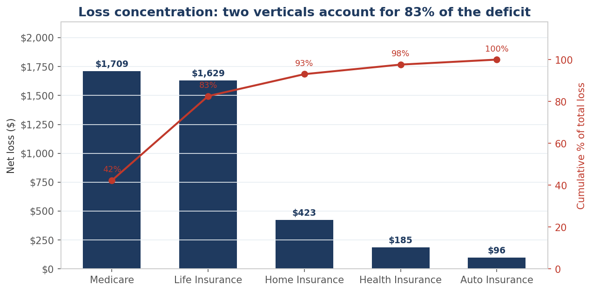
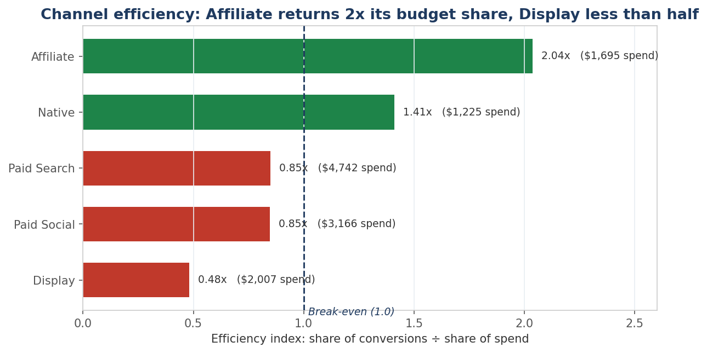
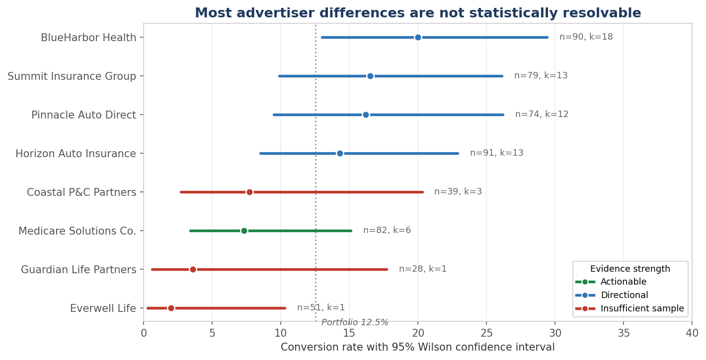
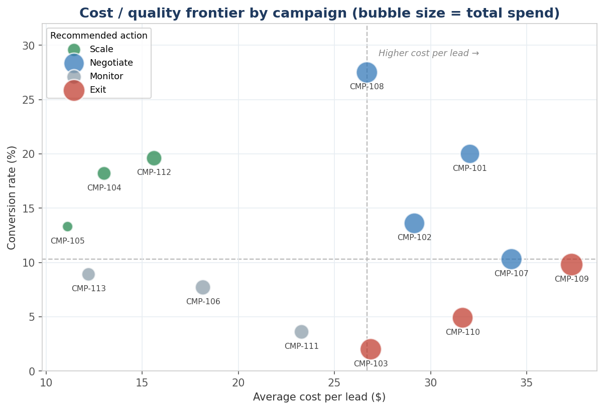
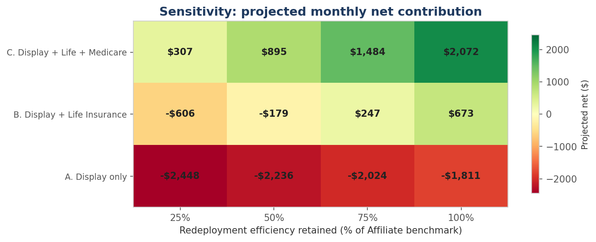

# Recovering Margin in a Leaking Lead Marketplace

### A campaign profitability analysis across 8 advertisers, 5 acquisition channels, and 534 leads

**Role:** Data Analyst (sole contributor)
**Stack:** SQL (DuckDB), Excel, Power BI, Python
**Period analysed:** July 2026

> **Note on data.** This is a portfolio project built on a synthetic dataset I generated to model a customer-acquisition marketplace. No proprietary, client, or consumer data is used. The business scenario is constructed. The analysis, formula logic, statistical tests, and every figure below are real outputs computed from that dataset and reproducible by running the code in this repository.

---

## Executive Summary

- **The problem was concentrated, not systemic.** Two of five verticals accounted for 83% of a $4,042 monthly loss, while the two largest verticals by volume were running within 5% of breakeven. The default response under consideration, an across-the-board budget cut, would have hit the segments closest to profitability.
- **The recommendation is to cut three segments and redeploy, not two.** A two-dimensional sensitivity analysis showed the narrower cut only reaches profitability if redeployed spend retains 75% or more of benchmark efficiency. The wider cut is profitable across every assumption tested, projecting **$4,300 to $6,100 in recovered monthly contribution.**
- **Statistical testing overturned two of my own initial recommendations.** Confidence intervals showed that three of eight advertiser-level conclusions rested on samples too small to support them. Those were withdrawn. The channel-level finding, which carries most of the projected value, survived testing and stands.

---

## 1. Business Context and Problem Statement

**Meridian Lead Exchange** is a customer acquisition marketplace in the insurance vertical. Meridian buys consumer leads across five channels and routes them to advertiser partners across Health, Life, Auto, Home, and Medicare. It pays a variable cost on acquisition and earns a fixed commission when an advertiser converts a lead.

The model turns on one spread: cost per acquired lead against commission earned per conversion. A few points of margin compression is the difference between a profitable quarter and a cash burn.

### The trigger

Finance closed the July books and flagged that media spend had outpaced commission revenue for a second consecutive month. Channel reporting lived in five disconnected platform exports. Nobody could answer the obvious follow-up: *which* part of the portfolio was bleeding.

### Stakeholders

| Stakeholder | Owns | Needed |
|---|---|---|
| VP of Marketplace Operations | Portfolio P&L | Whether the loss was concentrated or systemic, and how much was recoverable |
| Director of Advertiser Partnerships | Advertiser relationships and renewals | Performance evidence solid enough to open renegotiation |
| Media Buying Lead | Channel budget allocation | An efficiency ranking to redirect August budget against |

### Business questions

1. Where is margin actually being lost, and is the loss broad-based or concentrated?
2. Which channels convert efficiently enough to justify incremental budget, measured on CPA rather than volume?
3. What is recoverable if spend is reallocated away from structurally unprofitable segments?

---

## 2. The Data Journey

### Data preparation

The raw feed arrived as 548 records with two quality defects that materially moved the numbers.

**Duplicates (14 rows, 2.6%).** Webhook retries produced exact duplicate lead records. Deduplicated with `ROW_NUMBER()` partitioned on the business key, with an explicit `ORDER BY` so that which duplicate survives is a stated decision rather than an artifact of scan order.

**Null acquisition costs (27 rows, 4.9%).** Letting `SUM` silently skip blanks understates spend with no visible signal. Instead each null resolves to the campaign's contracted rate, with an `is_cost_imputed` flag carried through to the fact table. An imputed value that cannot be identified downstream is indistinguishable from a measured one.

**Why this mattered commercially.** Run on the raw feed, the analysis reports a blended CPA of **$178.00**, 70 conversions, and $9,258 revenue. Run clean: **$191.57**, 67 conversions, $8,793. The uncleaned view understates true acquisition cost by **7.6%** and reports three conversions and $465 of revenue that do not exist. The defects flattered precisely the campaigns that most needed scrutiny.

### Finding 1: The loss is concentrated



| Vertical | Leads | Conv. rate | CPA | ROI | Net |
|---|---|---|---|---|---|
| Health Insurance | 169 | 18.3% | $165 | -3.6% | -$185 |
| Auto Insurance | 165 | 15.2% | $87 | -4.4% | -$96 |
| Home Insurance | 39 | 7.7% | $236 | -59.8% | -$423 |
| Medicare | 82 | 7.3% | $472 | -60.4% | -$1,709 |
| Life Insurance | 79 | 2.5% | $1,012 | -80.5% | -$1,629 |
| **Portfolio** | **534** | **12.5%** | **$192** | **-31.5%** | **-$4,042** |

Health and Auto, carrying 62.5% of volume, were near breakeven. Life Insurance and Medicare alone accounted for **$3,338 of the $4,042 loss, or 82.6%**. Life Insurance was not marginally weak; at a 2.5% conversion rate against a $1,012 CPA it could not reach breakeven at any realistic acquisition cost.

### Finding 2: Channel efficiency varies by more than four times



| Channel | Leads | Conv. rate | CPA | ROI | Efficiency index |
|---|---|---|---|---|---|
| Affiliate | 81 | 22.2% | $94 | +42.3% | 2.04x |
| Native | 72 | 12.5% | $136 | -29.7% | 1.41x |
| Paid Search | 173 | 12.1% | $226 | -38.1% | 0.85x |
| Paid Social | 128 | 10.9% | $226 | -38.1% | 0.85x |
| Display | 80 | 6.2% | $401 | -68.9% | 0.48x |

The efficiency index divides each channel's share of conversions by its share of spend. Above 1.0 a channel earns its budget. Display consumed 15.6% of spend to deliver 7.5% of conversions.

### Finding 3: Most advertiser-level differences are not statistically resolvable

This is where the analysis corrected itself.



My first pass ranked advertisers on conversion rate and recommended offboarding the bottom three. Applying Wilson score intervals to those rates showed that three of the eight segments could not support a conclusion at all.

| Advertiser | n | Conv. | Rate | 95% CI | Evidence |
|---|---|---|---|---|---|
| BlueHarbor Health | 90 | 18 | 20.0% | [13.0%, 29.4%] | Directional |
| Summit Insurance | 79 | 13 | 16.5% | [9.9%, 26.1%] | Directional |
| Pinnacle Auto | 74 | 12 | 16.2% | [9.5%, 26.2%] | Directional |
| Horizon Auto | 91 | 13 | 14.3% | [8.5%, 22.9%] | Directional |
| Coastal P&C | 39 | 3 | 7.7% | [2.7%, 20.3%] | **Insufficient** |
| Medicare Solutions | 82 | 6 | 7.3% | [3.4%, 15.1%] | Actionable |
| Guardian Life | 28 | 1 | 3.6% | [0.6%, 17.7%] | **Insufficient** |
| Everwell Life | 51 | 1 | 2.0% | [0.3%, 10.3%] | **Insufficient** |

**Guardian Life Partners was withdrawn as an offboarding candidate.** Its interval spans 0.6% to 17.7% on a single conversion, which is entirely compatible with average performance. Coastal P&C is likewise unresolvable at n=39. Recommending contract action on either would have been a decision made on noise.

The classification uses the conventional minimum of five observed successes rather than interval width alone, because a segment with one conversion produces a deceptively narrow interval simply by sitting near zero.

**One scoping distinction that matters.** This classification governs conclusions about conversion *rate*. Cost-side conclusions are independent of it. Everwell Life is flagged insufficient for rate inference, yet its economic case remains decisive: a $1,012 CPA against a $190 commission cannot break even at any conversion rate inside its own interval. Distinguishing "we cannot measure this precisely" from "this cannot work arithmetically" is what keeps the Everwell recommendation while dropping the Guardian Life one.

**What survived.** Affiliate at [14.5%, 32.4%] and Display at [2.7%, 13.8%] do not overlap. The channel finding, which carries most of the projected value, stands.

### Finding 4: A geographic effect I investigated and chose not to act on

Regional analysis surfaced an apparent outlier: the Midwest at a 2.9% conversion rate against 13% to 19% elsewhere, an $821 CPA, and a -$2,064 net contribution. On its face the single worst segment in the portfolio.

It is statistically significant. Chi-square across regions returns p = 0.0063; Midwest against the rest returns Fisher exact p = 0.0004. The Midwest interval [1.0%, 8.3%] does not overlap any other region. I also tested whether it was a composition artifact, since a region overweight in Life or Medicare would show a deficit for reasons that have nothing to do with geography. It was not: the deficit persists within every individual vertical.

**I still did not recommend acting on it**, for a reason that has nothing to do with the p-value. This finding emerged from exploratory slicing across four dimensions, not from a pre-specified hypothesis. Testing enough cuts of a dataset reliably produces significant-looking results that do not replicate. The correct next step is to confirm the effect on an independent period before reallocating budget geographically, not to act on a result that arrived unprompted from a dimension I went looking through.

Flagged to the Media Buying Lead as a hypothesis to test, not a finding to action.

### Finding 5: A fifth of the period cannot be measured yet

Median time to convert is 3 days; p90 is 6 days. Leads acquired in the final six days of July therefore have not had time to convert, and their measured conversion rate is structurally understated. That window contains **20.2% of leads and $2,547 of spend**.

This is a methodological guardrail rather than a finding. It stops a reader concluding that late-month campaigns underperformed when they were simply measured too early, and it sets the minimum attribution window for the recurring version of this report.

### Finding 6: The cost/quality frontier gives each campaign an action



Plotting campaigns on cost per lead against conversion rate, split on portfolio medians, converts the analysis into a decision rule rather than a ranking. Four campaigns fall in the Scale quadrant, three in Exit. The three Exit campaigns (CMP-103, CMP-109, CMP-110) are exactly the Life and Medicare campaigns identified in Finding 1, reached by an independent method.

### Dashboard design

Built for a non-technical audience reviewing it in a standing operations meeting.

- **Headline KPIs above the fold.** The portfolio position is readable in five seconds without interpreting a chart.
- **Every value formula-linked, never typed.** The dashboard recalculates when the feed refreshes. Stale hardcoded numbers are what kill trust in recurring reporting.
- **Imputation rate surfaced on the dashboard itself,** not buried in documentation. A metric built partly on imputed inputs should say so where it is consumed.
- **ROI kept out of the visual layer.** A chart mixing positive and negative percentage bars reads as noise. The efficiency index communicates the same conclusion on a single positive scale.

---

## 3. Recommendations and Impact

### Recommendations

**1. Pause Display and redeploy into Affiliate.**
Display consumed $2,007 to return $625 at a $401 CPA, against Affiliate's $94. A 4.3x CPA gap against the best channel is a traffic quality problem, not a bidding problem, so the recommendation is a full pause pending a lead-quality audit with the supplier rather than an incremental bid reduction. This is the best-evidenced recommendation in the analysis: the two channels' confidence intervals do not overlap.

**2. Restructure or exit Life Insurance and Medicare.**
Both fail on economics independent of any conversion-rate inference. Life Insurance converted 2 of 79 leads; Medicare carries a $472 CPA against a $170 to $195 commission. Open renegotiation on commission rates with Everwell Life, with exit as the fallback. **Guardian Life Partners is explicitly excluded** from this recommendation despite appearing in the same vertical, because its sample cannot support the conclusion.

**3. Protect Health and Auto from across-the-board cuts.**
Both operate within 5% of breakeven while carrying 62.5% of volume. A uniform reduction, the default response to a portfolio loss, would cut the segments closest to profitability alongside the ones causing the loss. They are the destination for redeployed spend, not a source of savings.

### Projected impact

The original single-scenario projection hid the fact that the conclusion depends on two independent judgement calls: how aggressively to cut, and how much efficiency survives redeployment at higher spend. Varying both shows where the recommendation holds and where it breaks.



| Cut policy | 25% efficiency | 50% | 75% | 100% |
|---|---|---|---|---|
| A. Display only | -$2,448 | -$2,236 | -$2,024 | -$1,811 |
| B. Display + Life | -$606 | -$179 | +$247 | +$673 |
| **C. Display + Life + Medicare** | **+$307** | **+$895** | **+$1,484** | **+$2,072** |

The grid changed the recommendation. Policy A never reaches profitability under any assumption. Policy B, which was my initial recommendation, only works if redeployed spend retains 75% or more of benchmark efficiency, which is an optimistic assumption when scaling a channel beyond its current volume. **Policy C is profitable across the entire tested range**, which makes it the robust choice rather than the aggressive one.

**Concluding statement.** By pausing the Display channel and the Life Insurance and Medicare verticals, and redeploying $5,561 of monthly spend into Affiliate-led acquisition, Meridian is projected to recover **$4,300 to $6,100 in monthly contribution margin, or roughly $52,000 to $73,000 annualised**, converting a portfolio operating at a 31.5% loss into profitability without reducing total media investment.

**The assumption this rests on.** Redeployment efficiency is the model's largest sensitivity, which is why it is presented as a range rather than a point. Recommended next step is a two-week incremental spend test on Affiliate to establish the real efficiency curve before committing the full reallocation.

---

## 4. Technical Appendix

### Repository

```
data/            Synthetic source data (committed CSVs)
sql/             01 staging · 02 performance · 03 Power BI export · 04 advanced
powerbi/         Star schema, 25 DAX measures, model build guide
assets/          Figures, generated from the SQL views
run_analysis.py  Pipeline runner with a reconciliation gate
make_charts.py   Figure generation
DATA_DICTIONARY.md
```

### Techniques

| Layer | Applied |
|---|---|
| Data quality | `ROW_NUMBER()` dedup on business key, `COALESCE` imputation with a carried provenance flag, automated reconciliation gate |
| SQL | CTEs, window functions (`LAG`, `SUM() OVER ()`, cumulative frames), `NULLIF` denominator guards, parameterised scenario modelling |
| Statistics | Wilson score intervals, chi-square and Fisher exact tests, stratified confounding check, censoring quantification |
| Modelling | Star schema with conforming dimensions, single-direction relationships, 25 DAX measures |
| Excel | PivotTables, `VLOOKUP`, `SUMIFS`/`COUNTIFS`, nested `IF` imputation logic, formula-linked dashboard |

### Reproducibility

```bash
pip install duckdb pandas matplotlib scipy
python run_analysis.py    # asserts reconciliation, prints all views
python make_charts.py     # regenerates every figure
```

`run_analysis.py` asserts 534 leads, 67 conversions, $12,835.30 spend, and $8,793.00 revenue on every execution and exits non-zero if the pipeline drifts. Every figure in this document reconciles across the Excel workbook, the SQL layer, and the Power BI model.

### Known limitations

Single 31-day period, so no seasonality and no holdout to confirm findings on. No lead-quality attributes, so the analysis identifies *that* a channel underperforms but not *why*. No supplier or placement grain beneath channel. Full detail in `DATA_DICTIONARY.md`.
